# MLCN — Machine Learning Cybersecurity Network

> An end-to-end ML-powered SOC pipeline that simulates network attacks, captures live traffic, engineers flow-based features, and uses machine learning with explainable AI to detect and report threats in real time.

---

## 📖 Overview

**MLCN** is a Security Operations Center (SOC) simulation platform that demonstrates how Machine Learning can be integrated into a practical network-defense pipeline. The system consists of two sides: an **attacker component** capable of generating five distinct types of network attacks, and a **monitoring/service-server component** that continuously listens to network traffic, captures packets, extracts flow-level features, and feeds them into an ML model for detection.

Rather than training an isolated ML model on a static dataset, MLCN builds the full chain — attack generation → traffic capture → feature engineering → detection → explainability → reporting — to show how ML-driven threat detection actually operates inside a SOC workflow.

---

## 🏗️ Architecture / System Workflow

```text
Attacker (Client)
       ↓
   Network / Router
       ↓
Monitoring Client / API Service (bg) Server (SOC)
       ↓
Packet Capture (TCP, UDP, FTPS, HTTP, HTTPS, DNS, ICMP)
       ↓
Feature Extraction (FE) — Source/Destination IP & Port, Protocol, Duration, In/Out, Working Time
       ↓
Feature Engineering — Flow Duration, Packets/sec, Bytes/sec, SYN/ACK/FIN/RST Count, Forward/Backward Packets, Idle/Active Time
       ↓
Custom Dataset
       ↓
ML Model (XGBoost / Random Forest)
       ↓
Detection & Analysis (Attack Type, Confidence, Evidence, Recommended Action)
       ↓
Security Report
```



```mermaid
flowchart LR
    A[Attacker] -->|Attack Traffic| R[Router / Network]
    R --> S[Monitoring Client / API Service Server]
    S --> C[Packet Capture: TCP/UDP/FTPS/HTTP/HTTPS/DNS/ICMP]
    C --> FE[Feature Extraction]
    FE --> FEng[Feature Engineering]
    FEng --> M[ML Model: XGBoost / Random Forest]
    M --> D[Detection & Analysis]
    D --> Rep[Security Report]
```

The monitoring server sits between the attacker and the wider network, passively listening to relevant ports and protocols, extracting metadata from observed traffic, and turning it into a feature vector for the ML model to classify.

---

## ✨ Key Features

- 🎯 Simulated network attack generation (5 attack types)
- 📡 Continuous traffic monitoring over TCP, UDP, FTPS, HTTP, HTTPS, DNS, and ICMP
- 📥 Live packet capture and metadata extraction
- 🔁 Flow-based grouping of packets for more accurate ML input
- ⚙️ Feature engineering pipeline (CICIDS-style flow features)
- 🤖 ML-based attack detection and classification
- 🧠 Explainable AI (SHAP) for detection reasoning
- 📝 Automated SOC-style incident report generation
- 📊 Live monitoring dashboard
- 🗄️ Incident storage and history tracking

---

## 🎯 Attack Simulation

The attacker component can generate **five different types of network attacks**:

| Attack | Purpose |
|---|---|
| DDoS (Distributed Denial of Service) | Overwhelm the target server with traffic |
| Port Scan | Probe the target for open ports and services |
| Brute Force Attack | Attempt repeated login/credential guesses |
| SQL Injection (SQLi) | Exploit vulnerable input fields at the application layer |
| Botnet Traffic | Simulate traffic patterns from compromised/botnet hosts |

---

## 🧩 Core Modules

**Attack / Simulation Layer**
- **Attacker Client** — generates the five simulated attack types over the network

**Network Monitoring & Data Collection Layer**
- **Module 1 — Live Packet Capture Engine**: captures every packet entering/leaving the monitored server (candidate tools: Scapy, PyShark, Npcap, tshark)
- **Module 2 — Packet Parsing**: extracts fields such as source/destination IP, ports, protocol, packet length, timestamp, TCP flags, TTL, and window size
- **Module 3 — Flow Builder**: groups packets sharing the same source/destination IP, source/destination port, and protocol into flows over a time window, since ML models classify flows rather than individual packets

**Feature Engineering Layer**
- **Module 4 — Feature Engineering Engine**: converts flows into a numerical feature vector (flow duration, packets/sec, bytes/sec, SYN/ACK/FIN/RST/PSH/URG counts, forward/backward packets, IAT statistics, packet length statistics, etc.)

**Machine Learning Layer**
- **Module 5 — Machine Learning Detection Engine**: takes the feature vector and outputs an attack prediction with a confidence score
- **Module 6 — Explainable AI Engine**: applies SHAP to rank the features driving each prediction (e.g., high SYN count, low packet size, many destination ports)

**Analysis & Reporting Layer**
- **Module 7 — Threat Intelligence Engine**: sends the attack type, confidence, SHAP output, and flow statistics to an LLM (Gemini) to generate a structured SOC incident narrative, including MITRE ATT&CK mapping and recommendations
- **Module 8 — Incident Report Generator**: converts the LLM output into PDF, HTML, JSON, or Markdown reports containing incident number, timestamp, attack type, confidence, evidence, severity, and SHAP explanation
- **Module 9 — Dashboard**: displays live traffic, attack timeline, live alerts, top source/destination IPs, packets/sec, current threat level, attack statistics/heatmap, and generated reports
- **Module 10 — Incident Database**: stores attack records, timestamps, IPs, probabilities, SHAP values, LLM reports, and report paths

---

## 🤖 Machine Learning Pipeline

```text
Raw Network Traffic
        ↓
Packet Capture & Parsing
        ↓
Flow Building
        ↓
Feature Engineering
        ↓
Feature Vector
        ↓
ML Model (XGBoost / Random Forest)
        ↓
Prediction + Confidence
        ↓
Explainable AI (SHAP)
        ↓
Attack Detection / Classification
```

Candidate models: **XGBoost**, **Random Forest**, **LightGBM**, **CatBoost** — with **XGBoost** identified as the primary choice for this project.

---

## 🔄 End-to-End Workflow

1. Attacker initiates one of the five simulated attacks.
2. Attack traffic passes through the network to the monitoring server.
3. The monitoring client/API service captures relevant packets (TCP, UDP, FTPS, HTTP, HTTPS, DNS, ICMP).
4. Packets are parsed and grouped into flows.
5. Flow-level features are engineered (SYN/ACK/FIN counts, packet size, duration, etc.).
6. The feature vector is passed to the ML model.
7. The model predicts the attack type with a confidence score.
8. SHAP generates an explanation for the prediction (evidence and possible objective).
9. The Threat Intelligence Engine (Gemini) drafts a SOC incident narrative with recommended actions.
10. A final report is generated and made available on the dashboard.

---

## 🛠️ Technology Stack

```text
Python
Machine Learning (XGBoost / Random Forest / LightGBM / CatBoost)
Explainable AI (SHAP)
Packet Capture: Scapy, PyShark, Npcap, tshark
LLM Integration: Gemini
Networking & Traffic Analysis
```

---

## 📁 Project Structure

> Conceptual structure inferred from the module list — not yet finalized.

```text
MLCN/
├── attacker/                # Attack simulation (DDoS, Port Scan, Brute Force, SQLi, Botnet)
├── capture/                 # Live packet capture engine
├── flow_builder/             # Packet-to-flow grouping
├── feature_engineering/      # Flow feature extraction
├── ml_model/                 # Detection engine (XGBoost / Random Forest)
├── explainability/            # SHAP-based explanation engine
├── threat_intelligence/       # LLM-based SOC report generation
├── reports/                  # Generated PDF/HTML/JSON/Markdown reports
├── dashboard/                 # Live monitoring dashboard
├── database/                  # Incident storage
└── README.md
```

---

## 🚀 Getting Started

> Installation steps, dependencies, and configuration details are still being finalized for this project. This section will be updated with exact setup commands, required environment variables, and port configurations.

---

## ⚠️ Security / Ethical Use

MLCN's attack-simulation functionality is intended strictly for:

- Controlled lab environments
- Authorized penetration testing
- Cybersecurity education and research
- Local, non-production networks

Do not use the attacker component against systems you do not own or do not have explicit authorization to test.

---

## 🌟 Project Goal / Impact

MLCN demonstrates a complete, working intersection of **cybersecurity, networking, data engineering, feature engineering, and machine learning**. Rather than building an ML model in isolation, the project shows how raw network traffic can flow through capture, feature engineering, detection, explainability, and reporting stages — mirroring how ML-based detection fits into a real SOC pipeline.

---

## 🔮 Future Enhancements

- XAI-CN: expanding the explainable AI component into a full MVP
- Downloadable report/file exports
- Conversational AI interface for querying incidents
- Enhanced, more polished dashboard visualizations

---

## 📄 License

_No license has been specified yet for this project._
